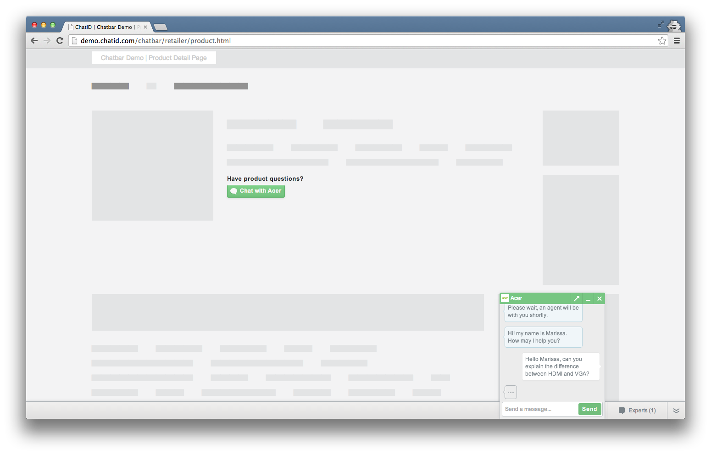
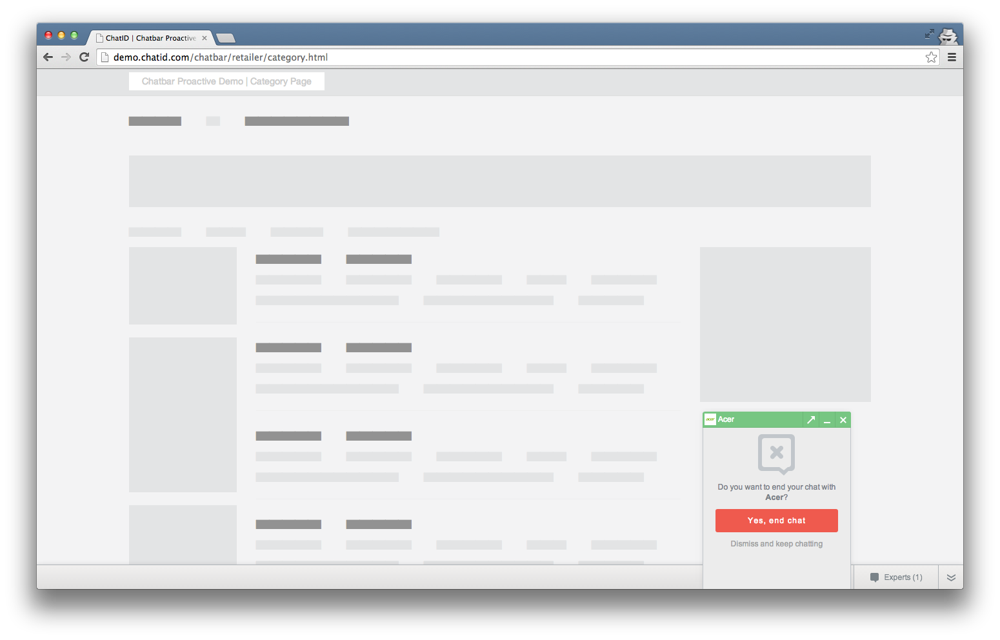

Screenshots
===========

> [Home](index.md) ▸ **Examples** ▸ **Screenshots**

Open the first screenshot and toggle through the flow using your arrow keys.

### For retailers

 displayed on product detail page (PDP)")

